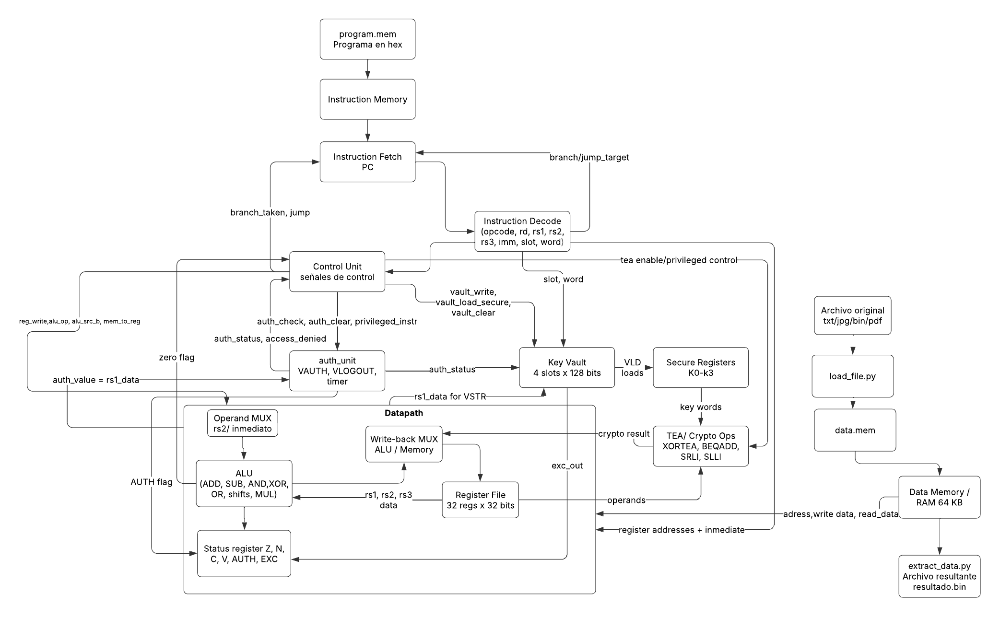

# Microarquitectura del procesador 
## Descripción General 
El procesador implementa una microarquitectura modular en SystemVerilog basada en un diseño tipo RISC y simulada con iverilog. La organización interna separa las etapas de busqueda, decodificación, control, ejecución, memoria y seguridad. 
Además se utiliza una arquitectura Harvard simplificada, donde la memoria de instrucciones y la memoria de datos se encuentran separadas.  

## Diagrama de bloques del procesador 
<p align="center">
  
</p>

<p align="center">
  <em>Figura 1. Diagrama de bloques de la microarquitectura del procesador.</em>
</p>
Como se muestra en la Figura 1, la microarquitectura del procesador está compuesta por los módulos principales, fetch, decode, control y datapath, junto con las unidades de memoria, seguridad y cifrado. 
El diagrama muestra la separación entre el flujo de instrucciones y el flujo de datos, así como la integración de los módulos de seguridad (´auth_unit´ y ´key_vault´) dentro de la arquitectura. 

## Componentes principales

| Módulo | Archivo | Función |
|---|---|---|
| Instruction Fetch | `instruction_fetch.sv` | Mantiene el PC y obtiene instrucciones desde `program.mem`. |
| Instruction Decode | `instruction_decode.sv` | Extrae opcode, registros, inmediatos, slot y palabra según el formato de instrucción. |
| Control Unit | `control_unit.sv` | Genera señales de control para ALU, memoria, saltos, bóveda y autenticación. |
| Datapath | `datapath.sv` | Conecta register file, ALU, MUXes y status register. |
| Register File | `register_file.sv` | Almacena registros generales de 32 bits. |
| ALU | `alu.sv` | Ejecuta operaciones aritméticas, lógicas, shifts y operaciones especiales. |
| Status Register | `status_reg.sv` | Guarda flags `Z`, `N`, `C`, `V`, `AUTH` y `EXC`. |
| Data Memory | `data_mem.sv` | RAM de 64 KB para datos y archivos cargados. |
| Key Vault | `key_vault.sv` | Almacena 4 llaves de 128 bits con acceso restringido. |
| Auth Unit | `auth_unit.sv` | Controla `VAUTH`, `VLOGOUT`, temporizador y acceso privilegiado. |


## Flujo de instrucciones

1. `instruction_fetch` lee una instrucción desde `program.mem` usando el PC.
2. `instruction_decode` separa los campos de la instrucción.
3. `control_unit` interpreta el opcode y genera señales de control.
4. `datapath` lee operandos desde el banco de registros.
5. La ALU ejecuta la operación indicada por `alu_op`.
6. El resultado se escribe de vuelta en el banco de registros, o se accede a memoria si la instrucción es `LD` o `ST`.
7. Si la instrucción es de salto, el PC se actualiza con `branch_target` o `jump_target`.

## Flujo de datos

Los archivos externos no se cargan como instrucciones, sino como datos. La herramienta `load_file.py` convierte archivos reales a formato `.mem`, generando `data.mem`. 
Este archivo es cargado en la RAM de datos y puede ser procesado por instrucciones `LD`, `ST` y operaciones criptográficas.

```text
archivo original → load_file.py → data.mem → Data Memory → CPU/TEA → memory_dump.txt → extract_data.py → archivo resultante
```

## Flujo de Seguridad 

Las instrucciones privilegiadas requieren autenticación previa mediante `VAUTH`. El módulo `auth_unit` compara el valor recibido desde un registro contra un secreto interno.
Si la autenticación es correcta, activa `auth_status` y permite instrucciones como `VSTR`, `VLD`, `VCLR`, `XORTEA`, `SRLI`, `SLLI` y `BEQADD`.
Si se ejecuta una instrucción privilegiada sin autenticación, se activa `access_denied` y el registro de estado marca una excepción.

## Interconexión entre módulos

Los módulos del procesador se comunican mediante señales de control y datos generadas por la unidad de control y el datapath.

- La **Instruction Decode** envía las direcciones de registros (`rs1`, `rs2`, `rd`) y valores inmediatos al datapath.
- La **Control Unit** genera señales que determinan el comportamiento del datapath, como selección de operandos, tipo de operación en la ALU y acceso a memoria.
- El **Datapath** interactúa con la memoria de datos mediante direcciones y datos de escritura/lectura.
- El módulo **auth_unit** recibe el valor de un registro (`rs1`) para validar la autenticación y envía el estado (`auth_status`) al resto del sistema.
- La **Key Vault** recibe instrucciones desde la unidad de control y datos desde el datapath, pero solo permite operaciones cuando el procesador está autenticado.
- La **ALU** envía flags como `zero` hacia la unidad de control para la toma de decisiones en instrucciones de salto.
- La unidad de control también coordina la interacción con el módulo de autenticación y la bóveda de llaves, asegurando que las instrucciones privilegiadas se ejecuten únicamente bajo condiciones autorizadas.
